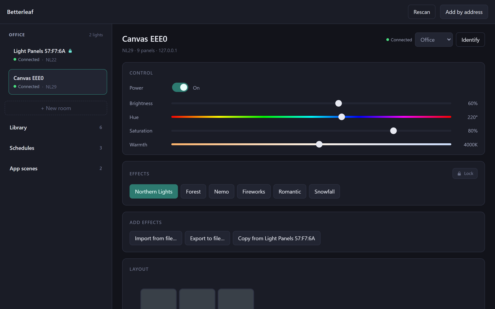

# Betterleaf

A better controller for Nanoleaf lighting products. Local-only — no cloud, no account.

**Site:** [betterleaf.cranium-ai.com](https://betterleaf.cranium-ai.com) — the
[download page](https://betterleaf.cranium-ai.com/download) and the
[user guide](https://betterleaf.cranium-ai.com/guide). Made by
[Cranium AI](https://cranium-ai.com). Free and open source under the
[MIT license](LICENSE).



Lights can be grouped into **rooms**, and every scene on your lights is
archived into a **local library**.

That last part is the interesting one. Nanoleaf’s Discover marketplace
delivers scenes *to the devices*, so the devices already hold everything you
have ever downloaded. Betterleaf reads them off and keeps a copy — no cloud
API, no account, nothing that can break. The archive outlives the
controller’s limited storage, so you can clear a scene off a light to make
room and put it back later with one click.

The official app is slow and unreliable at the one thing it has to do: find the
lights and change them. Betterleaf treats that as the product. Discovery races a
cached-address probe against mDNS, devices are identified by serial number so a
DHCP lease change can't lose one, writes are coalesced so a slider drag doesn't
choke the controller, and a single event stream per device replaces polling.

Target hardware, both verified against the simulator and intended for hardware
verification next:

| Device | Model | Streaming | Touch |
|---|---|---|---|
| Nanoleaf Canvas EEE0 | NL29 | extControl v2, UDP 60222 | yes |
| Nanoleaf Light Panels 57:F7:6A | NL22 | extControl v1, UDP 60221 | no |

Both speak the same REST API on port 16021, so the device layer is shared and
the differences live in one capability table. Adding Shapes, Lines or Elements
means adding a row, not a code path.

## Layout

```
packages/protocol/   The device layer. No Electron, no DOM, no native modules.
packages/app/        The desktop app: Electron main + preload + React renderer.
tools/simulator/     Fake NL22 + NL29: REST, SSE, mDNS, UDP sink.
tools/cli/           Command line over the protocol package.
```

`packages/protocol` is deliberately independent of the app. It can be unit
tested in Node, driven from the CLI, and reused later by a phone app without a
rewrite. Workspace packages resolve to TypeScript source rather than a build
directory, so there is no "forgot to rebuild" failure mode; the Electron app
will bundle it.

## Getting started

```bash
pnpm install
pnpm test          # 87 tests, no hardware needed
pnpm -r typecheck
```

### Running the app

```bash
pnpm dev     # electron-vite dev server with hot reload
pnpm app     # build and run the packaged main/preload/renderer
```

Devices live in the main process and the renderer only ever receives
serialisable snapshots, so reloading the window never drops a connection and
there is exactly one event stream per device however many views are open. Auth
tokens are stored in `app.getPath('userData')` encrypted with Electron's
`safeStorage` (DPAPI on Windows).

> **If the app exits immediately with `Cannot read properties of undefined
> (reading 'setName')`:** something in your shell has set
> `ELECTRON_RUN_AS_NODE=1`, which makes Electron run as plain Node so
> `require('electron')` returns a path string instead of the API. VS Code's
> extension host sets this and child processes inherit it. Launch from a plain
> terminal, or clear the variable for that command.

### Installing it properly

```bash
pnpm package             # -> packages/app/release/win-unpacked/Betterleaf.exe
pnpm package:installer   # -> packages/app/release/Betterleaf-Setup-<version>.exe
```

`pnpm package` produces a standalone app directory you can pin or shortcut to;
re-running it replaces the executable in place, so an existing shortcut keeps
working after a rebuild. `pnpm package:installer` builds an NSIS installer that
adds Start Menu and desktop shortcuts and registers an uninstaller.

The build is unsigned, so Windows SmartScreen will warn the first time the
installer runs ("More info" -> "Run anyway"). Signing needs a code-signing
certificate.

### Releasing

A release is a GitHub release on this repository with `Betterleaf-Setup-<version>.exe`
attached: bump the version in the three `package.json` files, `pnpm package:installer`,
create the release and upload the installer. The site's download page reads the latest
release from GitHub's API in the browser and links the installer straight from it, so
nothing on the site changes for a release.

### Screenshots

```bash
pnpm screenshots         # -> screenshots/*.png, from the simulator, never from real lights
```

Starts both fake devices on loopback, seeds a throwaway profile (`--user-data-dir`,
so your own pairings are untouched) with the lights paired, a room, schedules,
app rules and a lock, and captures each view over the DevTools protocol
(`scripts/screenshots.mjs`). The site repository converts them for the guide and
writes `docs/app.png` above.

The app icon lives in `packages/app/build/` as `icon.ico` (multi-resolution,
16-256px) and `icon.png`.

### Against the simulator

```bash
pnpm sim                     # fake NL22 on :16021, NL29 on :16022, advertising over mDNS
pnpm sim -- --no-advertise   # loopback only, no mDNS traffic
```

Then, in another terminal:

```bash
BETTERLEAF_HOME=./.betterleaf pnpm cli discover
BETTERLEAF_HOME=./.betterleaf pnpm cli pair 127.0.0.1 --port 16022
BETTERLEAF_HOME=./.betterleaf pnpm cli info canvas
```

`BETTERLEAF_HOME` overrides where the CLI stores paired devices, so
experimenting doesn't disturb your real config in `~/.betterleaf`. (The app keeps
its own store under `userData` and is unaffected either way.)

### Against real hardware

```bash
pnpm cli discover                    # find them
pnpm cli pair 192.168.1.50           # hold the power button 5-7s when asked
pnpm cli identify canvas             # confirm you paired the one you meant
pnpm cli info canvas
pnpm cli state canvas --on --brightness 60
pnpm cli watch canvas                # live state / effect / touch events
pnpm cli stream canvas --seconds 10  # moving gradient over UDP
pnpm cli save-scene canvas "Rainbow" # write a scene onto the device permanently
```

A target matches a serial prefix, a model number, or part of the name, so
`pnpm cli state canvas --on` works. Omit it entirely when one device is paired.

## CLI reference

| Command | Purpose |
|---|---|
| `discover [--ip <addr>]` | Find devices; `--ip` adds a manual address |
| `pair <ip> [--port N]` | Acquire a token during the pairing window |
| `list` / `forget [target]` | Show or remove paired devices |
| `info [target]` | Model, capabilities, panel count, current state |
| `state [target] [--on\|--off\|--brightness N\|--hue N\|--sat N\|--ct N]` | Change state |
| `effects [target] [name]` | List effects, or apply one |
| `layout [target]` | Panel positions, and what gets filtered out |
| `identify [target]` | Flash the panels |
| `plugins [target]` | Motions this device actually has |
| `motions` | Built-in motions effects can be authored from |
| `export-effects [target] [file]` | Save every effect on the device to JSON |
| `import-effect <target> <file> [--name X]` | Write effects from a file onto the device |
| `watch [target]` | Live event stream |
| `stream [target] [--seconds N] [--restore <effect>]` | Stream over UDP |
| `save-scene [target] [name]` | Write a scene onto the device permanently |

## Hardware verification checklist

The simulator is an honest emulation of the parts Betterleaf depends on, but it
is not the hardware. These need real panels:

- [ ] `discover` finds both units with correct models and serials, under 2s cold
- [ ] `identify` flashes the unit you expect
- [ ] Brightness and hue sweeps are smooth, with no lag or queue backup
- [ ] `stream` works: NL29 over v2/60222, NL22 over v1/60221
- [ ] `watch` shows Canvas touch gestures with the right panel id
- [ ] `save-scene`, then quit and power-cycle — the effect is still there and
      visible in the official app
- [ ] `layout` on the NL22: confirm which `panelId`/`shapeType` the Rhythm module
      reports, and that excluding it is correct
- [ ] `layout` on the NL29: confirm whether the control square is illuminated
- [ ] Pull power on one device — status goes Unreachable, not a hung spinner;
      restore power and it recovers unattended
- [ ] Force a DHCP lease change — it reconnects without re-pairing

The last two are the whole point of the project, so they matter most.

Two open questions are marked `TODO(hardware)` in the source: whether effect
writes need an explicit `"version": "2.0"` field, and the Rhythm/control-square
`shapeType` values above. Community sources disagree; the hardware decides.

## Contributing

Issues and pull requests are welcome on GitHub. The conventions that keep the app
responsive and honest about state are in [CLAUDE.md](CLAUDE.md), which is written
for anyone working on the code, human or otherwise; the four rules at its top are
the ones not to undo without a reason. `pnpm test` and `pnpm -r typecheck` run in
CI on every push.

## Notes on Docker

Docker is a good fit for CI, the simulator and reproducible test runs. It is not
usable for the real-device path on Windows: Docker Desktop routes containers
through NAT'd WSL2 networking, so mDNS and SSDP multicast never reach the LAN and
the panels are undiscoverable from inside a container. Hardware work runs
natively.

## Protocol reference

Base URL `http://<ip>:16021/api/v1/<token>`.

| Endpoint | Notes |
|---|---|
| `POST /api/v1/new` | Only during the 30s pairing window |
| `GET /` | Full device document, including `serialNo` |
| `PUT /state` | `on`, `brightness` 0–100, `hue` 0–360, `sat` 0–100, `ct` 1200–6500 |
| `PUT /effects` | `{"select": name}` to apply, `{"write": {...}}` to modify |
| `GET /panelLayout/layout` | `positionData[] = {panelId, x, y, o, shapeType}` |
| `GET /events?id=1,2,3,4` | SSE: state, layout, effects, touch |
| `PUT /identify` | Flash the panels |

Streaming is enabled with
`{"write": {"command": "display", "animType": "extControl", "extControlVersion": "v2"}}`.
Light Panels answer with `streamControlPort`; Canvas returns an empty body and
expects the well-known port. Frame layout:

```
v1 (NL22)   u8 nPanels | per panel: u8 id, u8 nFrames=1, u8 R,G,B,W, u8 transTime
v2 (NL29)   u16be nPanels | per panel: u16be id, u8 R,G,B,W, u16be transTime
```

`transTime` is in units of 100ms. Cap the send rate at 10Hz; the devices drop
frames above that.
